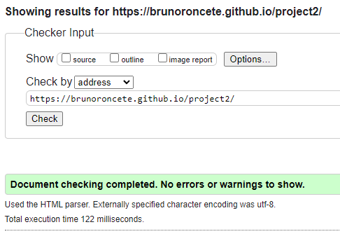
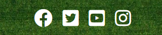

# MATCH THE FLAGS

This comprehensive site was designed for the second of four Milestone Projects that the developer must complete during the Full Stack Web Development Program at The Code Institute. The main requirements were to make a responsive page that respond to the user's actions, allowing users to actively engage with data, alter the way the site displays the information to achieve their preferred goals.
## UX

The purpose is to design an attractive website, so the players can enjoy and have fun with the game.

## User Stories
### First Time Visitor Goals
1. As a first time visitor, I want to easily see if the gym offers the service that I am looking for.
2. As a first time visitor, I want to find information about the classes that the gym offers.
3. As a fisrt time visitor, I want to find out the cost of the services provided.

## Design
### Colour Scheme

- The main colours used are green, white and black, to give the site a clean, modern and professional look.

### Typography

- The Fredoka one font is used throughout the website with Sans Serif.

### Wireframes

#### index.html
1. [Desktop index.html](assets/images/web.png)

2. [Mobile index.html](assets/images/phone.png)

3. [Tablet index.html](assets/images/tablet.png)
## Existing Features

### Navigation Bar

- Desktop Navbar

## Frameworks, Languages & Programs Used

### [VSCode](https://code.visualstudio.com/)
- This developer used VSCode for their IDE while building the website.

### [BootstrapCDN](https://www.bootstrapcdn.com/)
- The project uses Bootstrap v 5.1.0 to simplify the structure of the website.
- The project also uses BootstrapCDN to provide icons from FontAwesome.
### [Google Fonts](https://fonts.google.com/)
- The project uses Google fonts to style the website fonts.

### [Balsamiq](https://balsamiq.com/) 
- The project uses Balsamiq to create the wireframe mockups.

### HTML 5 
- Markup language designed to be displayed in a web browser.

### CSS 3
- Style sheet language used for describing the presentation of a document in HTML.

### Javascript

- 
## Testing

### Development Testing

-  I used the Google Chrome Developer tools during the development of the website to inspect the site at different device sizes and in responsive mode.

### Manual Testing

- Navigation Bar

1. When the company name is clicked, it returns the user to the index.html from all pages.
2. When each link on the navbar is clicked, it takes the user to the correct page.

- Social Media Links
1. When each link is clicked, it opens a new tab.
2. When each link is clicked, it takes the user to the correct page.

- Forms
1. When submitted the form link to the correct place.

### Code Validation

The W3C Markup Validator and W3C CSS Validator Services were used to validate the project to ensure there were no syntax errors in the project.

- W3C Markup Validator

index.html

- W3C CSS Validator 

- Lighthouse

I used the Lighthouse on Google Developer Tools to check the Perfomance, Accessibility, Best Practices and SEO of the website.

- PowerMapper 

PowerMapper was used to double-check the browser compatibility.
## Testing User Stories from User Experience (UX) Section
### First Time Visitor Goals
1. As a first time visitor, I want to easily see if the gym offers the service that I am looking for.
    - At the nav bar on top of the site contains a link to the page classes.
    - The classes page contains all the classes offered by the gym.

2. As a first time visitor, I want to find information about the classes that the gym offers.
   - At the page classes.html the customer has access to the timetable and the description of the classes.

3. As a fisrt time visitor, I want to find out the cost of the services provided.
    - At the index.html the customer has access to a section with the prices of the memberships.

### Returning Visitor Goals
1. As a Returning Visitor, I want to find the best way to contact the gym.
    - At the footer the user has access to the contact information and a text area where is possible to contact the gym.

2. As a Returning Visitor, I want to be able to access your social media accounts.
    - The footer presents icons with links to the social medias.
    - Each link opens the social media in a new page.

    

### Frequent User Goals
1. As a Frequent User, I want to be able to book my classes.
    - At the classes.html page the user can find the Book Now buttons that opens the form to book an appointment.

  

### Issues
- The form in the joinnow.html page wasn't working, I asked for help at Slack and the community pointed that my code was missing id's and names, the issue was fixed after adding that.
- The buttons at the classes.html page cards weren't aligning, after asking for help at Slack, a mentor suggested adding height, after adding the code .card-body p {    min-height: 140px;}, the issue was fixed.

### Known Bugs

- The nav bar on small screen's scrolls with the rest of the page when the dropdown menu is active.

## Deployment

This project was developed using Visual Studio Code Insiders, committed to git and pushed to GitHub using git bash terminal.

### Deploying on GitHub pages

1. Log in to GitHub and navigate to the GitHub Repository.
2. At the top of the repository, select "Settings" from the menu items.
3. At the Settings menu, select "Pages".
4. Select the main branch and the page will be automatically refreshed with a detailed ribbon display to indicate the successful deployment.

The live link can be found here - https://brunoroncete.github.io/project2/

### Forking the GitHub Repository

By forking the GitHub Repository we make a copy of the original repository on our GitHub account to view and/or make changes without affecting the original repository by using the following steps.

1. Log in to GitHub and locate the GitHub Repository
2. At the top of the Repository (not top of page) just above the "Settings" Button on the menu, locate the "Fork" Button.
3. You should now have a copy of the original repository in your GitHub account.

### Making a Local Clone

1. Log in to GitHub and locate the GitHub Repository
2. Under the repository name, click "Clone or download".
3. To clone the repository using HTTPS, under "Clone with HTTPS", copy the link.
4. Open Git Bash
5. Change the current working directory to the location where you want the cloned directory to be made.
6. Type git clone, and then paste the URL you copied in Step 3.
7. Press Enter. Your local clone will be created.

## Credits

### Code

- Bootstrap v 5.1.0: Bootstrap was used throughtout the project mainly the buttons, cards and carousel.
- Google Maps Help: [This](https://support.google.com/maps/answer/144361?co=GENIE.Platform%3DDesktop&hl=en) Google Maps Help explained how to embed the map into the html code.
- FontAwesome: The icons in the footer were taken from Font Awesome.

### Media

- All images were sourced from [Unsplash](https://unsplash.com/) or [Pexels](https://www.pexels.com/).
- [Canva](https://www.canva.com/) were used to make the logo.

### Acknowledgements

- Student care and fellow students at Code Institute for their support.
- I would like to thank my mentor, Seun, for her invaluable help and guidance throughout the process.

